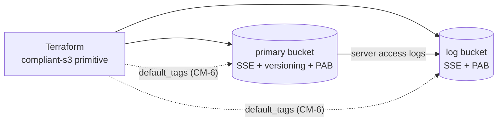

# NIST 800-53 Controls as Terraform Resources

**An S3 bucket pair (data + access logs) where every hardening decision is annotated with the NIST 800-53 control it implements — control-to-code mapping you can read in the diff.**


> Compliance frameworks name controls; engineers ship resources. This project closes that gap in the most literal way possible: each Terraform resource carries a comment naming the 800-53 control it enforces, so the *code review is the control review*.

## The problem it solves

When an auditor asks "show me AC-3 for this bucket," most teams produce a screenshot or a spreadsheet row. Here, the answer is a link to a resource block whose comment says `# AC-3: Access control — explicit deny on every public access vector`, followed by the `aws_s3_bucket_public_access_block` that enforces it. The mapping lives where it can't drift silently: in version control, next to the thing it describes.

## Controls implemented

| Control | Title | Enforced by |
| --- | --- | --- |
| AC-3 | Access Enforcement | `aws_s3_bucket_public_access_block` on **both** buckets — all four public-access vectors blocked |
| AU-3 / AU-6 | Content of Audit Records / Audit Review | Dedicated log bucket + `aws_s3_bucket_logging` shipping server access logs to `access-logs/` |
| CM-6 | Configuration Settings | Provider `default_tags` stamping `Project` / `Environment` / `ManagedBy` / `ComplianceScope` on every taggable resource; versioning preserving prior object states |
| SC-28 | Protection of Information at Rest | `aws_s3_bucket_server_side_encryption_configuration` (AES-256; the commented KMS block shows the CMEK upgrade path) |

Input validation guards the blast radius: `project_name` must match a naming regex, `environment` must be one of `dev`/`staging`/`prod` — bad values die at `plan`, not in production.

## Architecture



## Repository layout

```
.
├── terraform/primitives/compliant-s3/
│   ├── main.tf          # provider defaults, both buckets, all controls (annotated)
│   ├── variables.tf     # validated inputs: project_name, environment, bucket_suffix
│   ├── outputs.tf       # ARNs, names, and encryption_algorithm read back as SC-28 attestation
│   └── README.md        # module reference
├── evidence/
│   └── plan.json        # terraform show -json of an applied run (machine-readable evidence)
├── .github/workflows/
│   └── validate.yml     # fmt / validate / tflint / checkov on every push and PR
└── .gitignore           # state, plans, providers, tfvars — never committed
```

## Reproduce it

Prerequisites: Terraform ≥ 1.6, AWS credentials for a sandbox account.

```bash
cd terraform/primitives/compliant-s3
terraform init
terraform plan -var 'project_name=my-lab' -var 'environment=dev'
terraform apply -var 'project_name=my-lab' -var 'environment=dev'

# SC-28 attestation, read back from real state rather than asserted:
terraform output encryption_algorithm   # -> "AES256"
```

Capture evidence the same way this repo's `evidence/plan.json` was produced:

```bash
terraform plan -out tfplan -var 'project_name=my-lab' -var 'environment=dev'
terraform show -json tfplan > evidence/plan.json
```

## Design decisions worth noting

- **AES-256 rather than KMS, on purpose.** SSE-S3 keeps the lab free of key-management prerequisites; the commented-out `aws:kms` rule in `main.tf` documents the exact upgrade path to CMEK (covered by the sibling module project — see Context).
- **Evidence is plan JSON, not raw state.** Plans show intent and configuration without carrying state internals. (An earlier iteration committed `state.json`; the plan-only policy is the going-forward standard, consistent with the evidence-pointer model in *iac-as-compliance-evidence*.)
- **Log delivery uses the legacy ACL mechanism** (`log-delivery-write` + ownership controls). It works on provider v5.x; migrating to the bucket-policy grant for `logging.s3.amazonaws.com` is on the roadmap below.

## Limitations / roadmap

Lab-scoped by design: no KMS/CMEK yet, no lifecycle rules, no cross-region replication, local state (no backend). Each is a deliberate scope cut for a single-service lab, and each is a documented `checkov` skip in `.checkov.yaml` rather than a silent suppression. Next steps: bucket-policy-based log delivery, CMEK variant, and lifecycle/retention rules.

## Context

Part of the **GRC Engineering Club** Compliance-as-Code curriculum (CGEP) — the first of three projects that build on each other:

1. **This repo** — controls annotated onto resources (control → code mapping)
2. [`terraform-modules-for-compliance`](https://github.com/JayYoungCareers/terraform-modules-for-compliance) — controls *enforced* by module design: a hardcoded compliance floor consumers cannot disable
3. [`iac-as-compliance-evidence`](https://github.com/JayYoungCareers/iac-as-compliance-evidence) — runs captured as hashed, signed, immutably stored audit evidence
